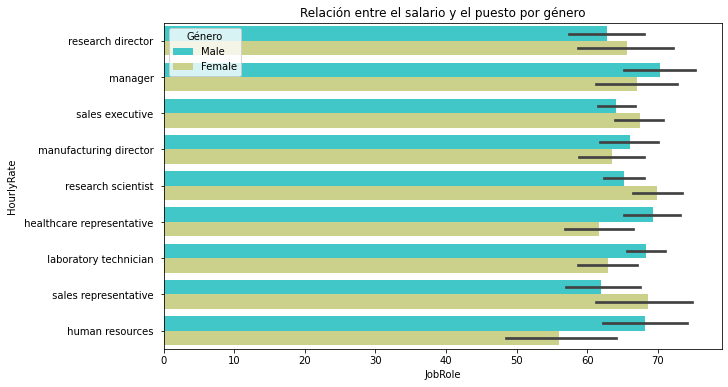

# Reporte de resultados 

## Contexto general 

En este apartado se muestran algunos gráficos que hacen visible la distribución de los empleados en función de factores como la edad, el salario, etc... 

### Edad 

En este gráfico se observa que existen empleados de todas las edades en la empresa, cpncentrándose, la mayoría de ellos en edades comprendidas entre los 30 y los 40 años.

### Género 

Observamos que hay más hombres que mujeres en la empresa.

### Distribución de salarios

Hay una variedad de salarios amplia (con empleados que cobran 30 €/hora hasta 100 € la hora). Hay un pico alrededor de 68 €/hora. 

### Distancia del hogar a la empresa 

Vemos que la mayoría de los empleados viven relativamente cerca del lugar de trabajo. 

## Resultados del análisis de satisfacción

### Environment Satisfaction

**Conclusión**: Existe una diferencia significativa en la cantidad de attrition según el grupo de satisfacción, por lo que la hipótesis H0 quedaría descartada. Sí hay una relación entre la satisfacción con el ambiente laboral y la rotación de los empleados.

### Job Satisfaction

Establecemos las hipótesis:
- H0 : No existe una relación entre el nivel de satisfacción con el trabajo y la rotación de empleados en la empresa
- H1: Existe una relación entre el nivel de satisfacción con el trabajo y la rotación de empleados en la empresa

**Conclusión**: Existe una diferencia significativa en la cantidad de attrition según el grupo de satisfacción, por lo que la hipótesis H0 quedaría descartada. Sí hay una relación entre la satisfacción con el trabajo y la rotación de los empleados.

### Environment Satisfaction

Establecemos las hipótesis:
- H0 : No existe una relación entre el nivel de satisfacción con las relaciones en el trabajo y la rotación de empleados en la empresa
- H1: Existe una relación entre el nivel de satisfacción con las relaciones en el trabajo y la rotación de empleados en la empresa

## Otros factores de influencia

### Total Working Years

En el gráfico observamos que parece existir una relación entre los años que un empleado lleva en la empresa y la rotación (a mayor número de años en la empresa, menor rotación)
Vamos a comprobar si existe una diferencia significativa.

Para la columna TotalWorkingYears los datos no siguen una distribución normal.

### Age

Para la columna Age los datos no siguen una distribución normal.

### Years With Current Manager

Aunque hay diferencias significativas, creemos que tiene que ver con que las personas que llevan más años en la empresa, llevan más años con el mismo manager. No nos da mucha información sobre si la veriable influye o no en la rotación de empleados

### Relación entre el salario y el puesto entre los dos géneros

### Relación entre el salario y el puesto entre los dos géneros

- Lo primero que nos llama la atención es que no existe una jerarquía clara entre salarios de distintas responsabilidades. Por ejemplo, cabe esperar que de acuerdo con la jerarquía de puestos dentro de la empresa, el salario vaya acorde con éste. 
- Lo siguiente es la diferencia en el promedio de salarios entre hombres y mujeres en los diferentes puestos. 

## Recomendaciones para la empresa 

### 1. Datos incompletos.

Tras en análisis de los datos, lo primero que encontramos es una elevada cantidad de datos incompletos. Una recopilación cuidadosa de los datos aporta mucha precision a la hora de realizar cualquier análisis posterior. Una de nuestras recomendaciones a la empresa sería la de ser más precisos en esta tarea. 

Algunas de las columnas, como NumberChildren, no contienen datos. Tener datos en esta columna aportaría información valiosa a la empresa para la gestión de temas que influyen en la satisfacción de los empleados, como es la conciliación familiar.

### 2. Recopilación no uniforme de los datos.

Algunos de los datos que la empresa ha recopilado, no tienen mucho sentido. Por ejemplo, a la hora de hacer las encuestas, se les ha pedido a los empleados que respondan acerca de su grado de satisfacción con diferentes aspectos del trabajo en una escala del 1 al 4. Algunas de las respuestas obtenidas estań en números del 1 al 50. Ante esta situación, hemos tenido que tomar decisiones sobre qué hacer con éstos:¿tomarlos como una escala del 1 al 50?¿tomarlos como si fueran, enrrealidad, números decimales?